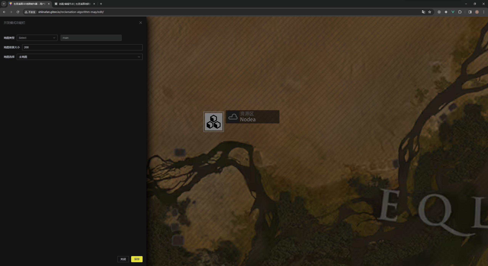

一般来说你可能会制作百变陌域的地图，关于各地图的特殊规则，你可以点击 `等待制作` 来查看关于各种地图的规则。

在右键菜单中点击 `打开地图工具栏` 开启切换选择。

接下来对可能需要的字段进行说明：

- 地图类型：目前有主地图陌域两种，如果制作陌域直接选择制作用陌域即可
- 地图背景大小：在不同陌域背景可能有不同的大小，一般来说，主地图大小为 `200`，陌域为 `90`
- 地图选择：地图的背景图片

设置好后点击工具栏右下角的 **`保存`** 按钮进行修改。