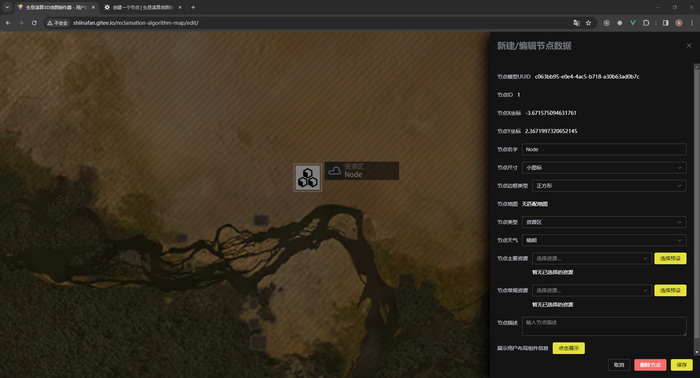

在地图上按下鼠标右键可以弹出工具菜单，红点代表点击位置，用来参考节点预期位置。

点击第一个选项可以创建节点并弹出编辑信息侧边栏。

其中仅对部分比较特殊的信息字段配置进行说明：

- 节点名字：一般来说输入的名字需要与地图上保持相同，这样一些其他信息类似描述与地图才可自动生成
- 节点地图/节点描述：根据节点名字生成，无需手动设置
- 节点主要/常规资源：选择预设按钮暂时无法使用；通过下拉选择框点击直接进行添加
  （体验一下就知道怎么用了）
- 展示用户组件：点击后会展示用户信息的展示

在编辑完后点击 `保存` 按钮来更新地图上的节点信息。**这样才会把信息更新至地图**

如果你想要改位置的话，还是先删了节点再新建一个吧。（等待佬实现修改位置）

当一个节点在地图被创建后，你可以通过点击他再次弹出编辑菜单。