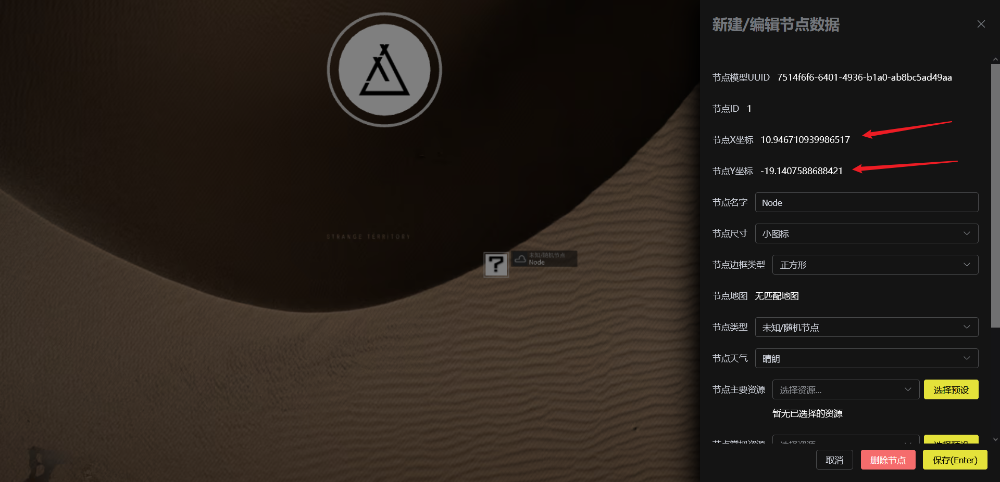
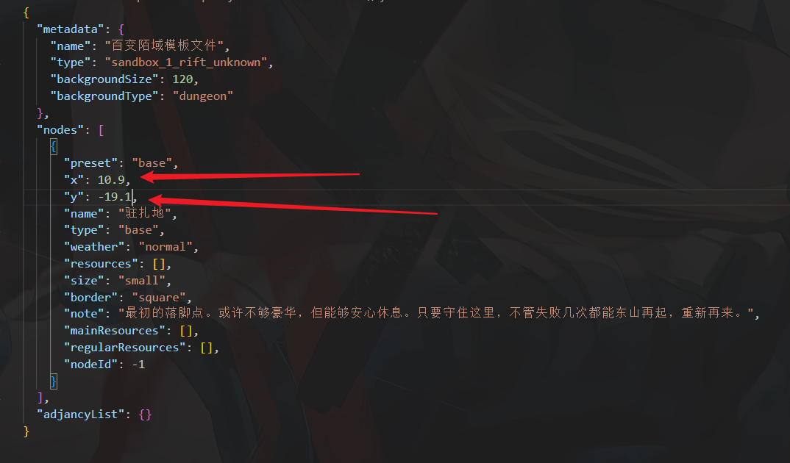

:::caution[阅读文章之前]
请关注本页面底部最后更新时间，并且该制图流程可能由于工具更新导致与实际地图功能稍微有出入
:::

## 百变陌域制图流程

### 环境

本人是配有两块电脑屏幕，一块看制图页面，另一块可以看节点图

你可以手机放节点图片来做参考

其他的只要显卡别太差就行（恼

### 加载模板文件

<a href="" filename="template.json" download="/reclamation-algorithm-map/docs/edit/template.json">点击这里</a> 下载一份包含驻扎地的模板

### 确定驻扎地坐标

加载刚刚下载的模板文件，然后在地图上通过右键创建一个坐标来确定驻扎地的实际位置：

json 文件内坐标仅保留小数点一位。

### 精度与实际要求

通常针对陌域不会有太高的节点精度，因为各个节点较为松散，只要确认大概位置即可

### 快速放置节点

流程如下：

- 右键创建节点
- 鼠标聚焦到节点名字（未来可能实现自动聚焦，该步骤在未来可能可以省略）
- 粘贴 “未知” 俩字
- 按下 `Enter` 快速保存

一般在这种流程下完成一张陌域图节点制作仅需要3分钟左右

### 连线

暂无技巧，平均 `1~2` 分钟
